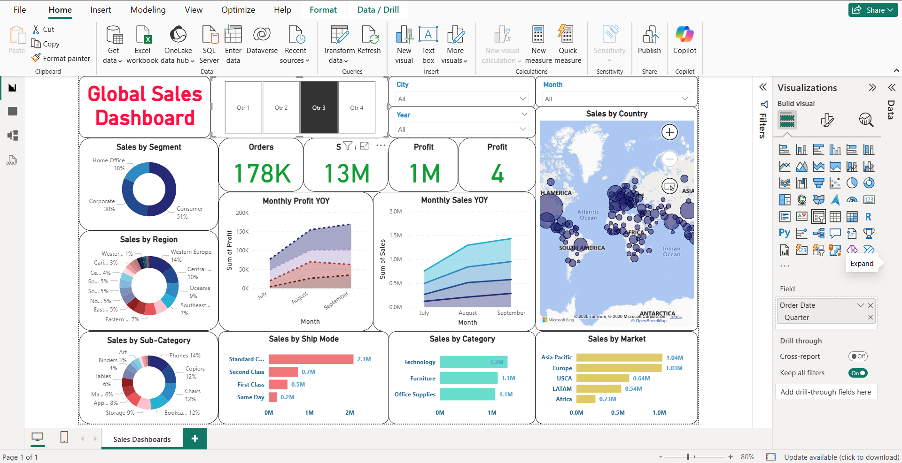

# 🌍 Global Sales Analysis – Power BI Dashboard

This project analyzes global sales data to identify trends, regional performance,
and product-level insights using Power BI.

## 📊 Dashboard Preview

## 🎯 Objectives
- Analyze sales performance across regions and countries
- Identify top-performing products and categories
- Track sales trends over time
- Support data-driven business decisions

## 🛠 Tools & Technologies
- Power BI Desktop
- SQL (data transformation)
- Snowflake
- Excel / CSV
  

## 🔍 Key Insights
- North America and Europe generate the highest sales
- Technology category contributes maximum revenue
- Seasonal spikes observed during Q4

## 📌 Note
Power BI reports cannot run directly on GitHub.
This repository is used for documentation and project showcase.
# Power-BI-global-sales-analysis
Power BI dashboard project with data analysis and insights
